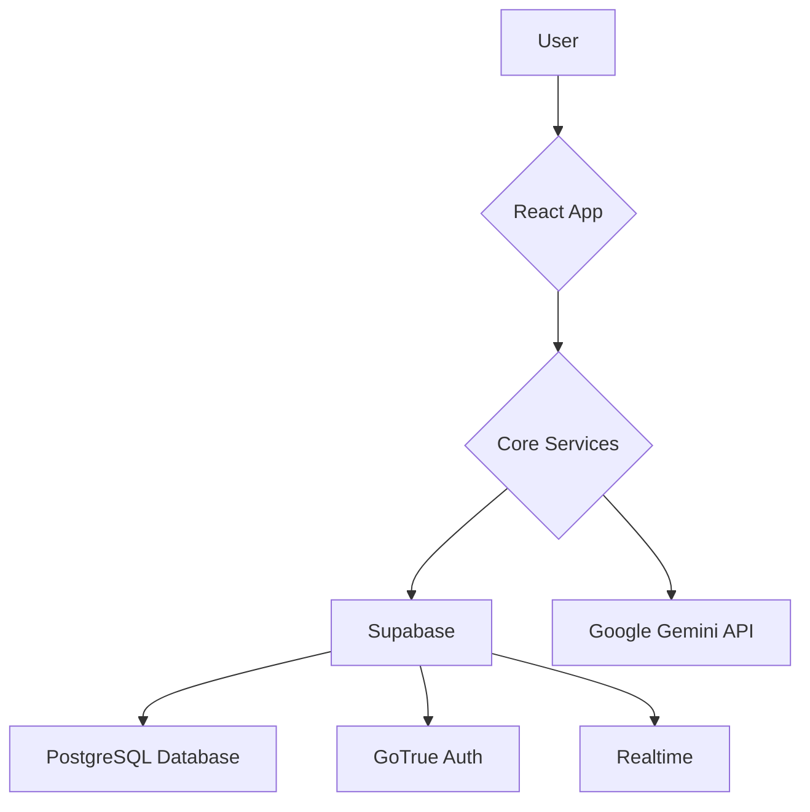

# Architecture

This document provides an overview of the system architecture, its components, and the data flow between them.

## High-Level Overview

The system is a monorepo containing a React-based web application, a Supabase backend, and a set of shared core services.

## Components

*   **React App:** The client-side application that the user interacts with. It is built using React and Vite.
*   **Core Services:** A collection of shared services that can be used by both the client and the server. These services are responsible for interacting with the database, external APIs, and other parts of the system.
*   **Supabase:** The backend for the application. It provides a PostgreSQL database, authentication, and realtime capabilities.
*   **Google Gemini API:** Used for interpreting user search queries.

## Data Flow

1.  The user interacts with the React App.
2.  The React App calls the Core Services to fetch data or perform actions.
3.  The Core Services interact with Supabase to query the database, authenticate users, and subscribe to realtime updates.
4.  The Core Services also interact with the Google Gemini API to interpret search queries.
5.  Supabase interacts with the underlying PostgreSQL database, GoTrue for authentication, and the Realtime engine for realtime updates.

## Worker Categories

The platform categorizes workers into the following areas of expertise:

| Category      | Expertise                                       |
|---------------|-------------------------------------------------|
| **Cleaning**  | Residential and commercial cleaning services.   |
| **Plumbing**  | Pipe repair, installation, and maintenance.     |
| **Electrical**| Wiring, fixture installation, and repairs.      |
| **Landscaping**| Garden design, maintenance, and lawn care.    |
| **Painting**  | Interior and exterior painting services.        |
| **Moving**    | Relocation and transportation services.         |
| **Handyman**  | General repairs and maintenance tasks.          |
